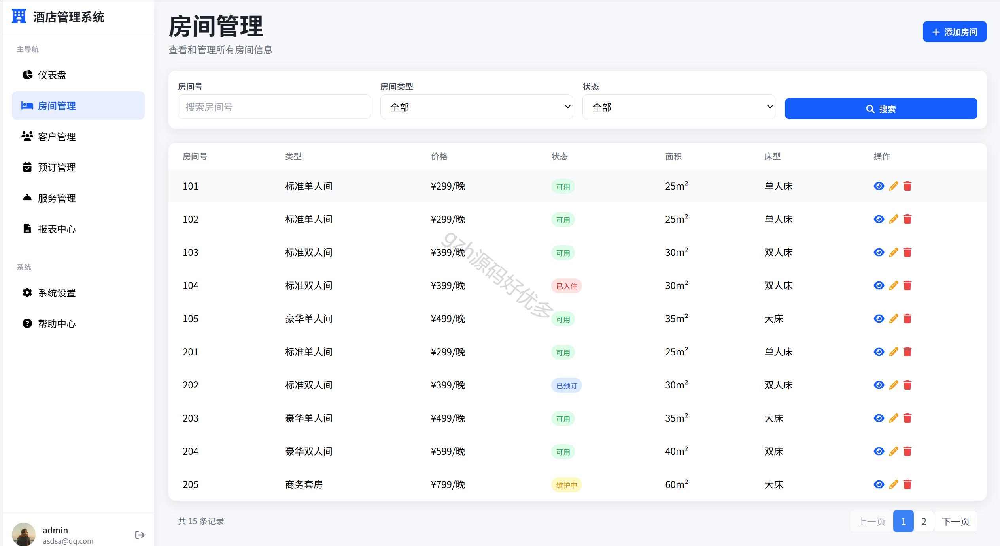
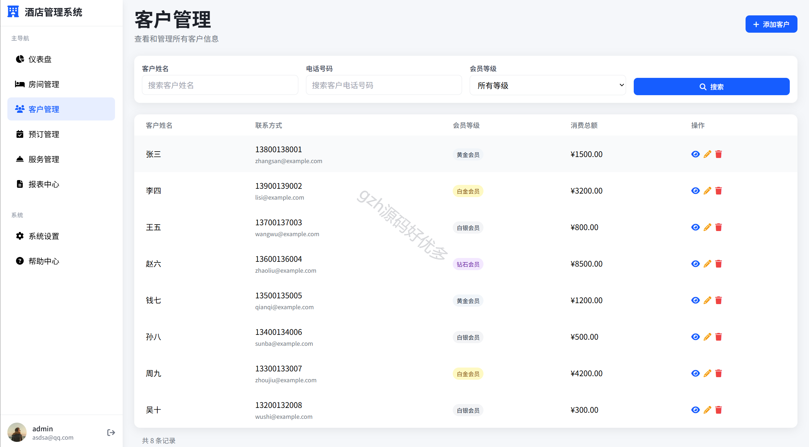
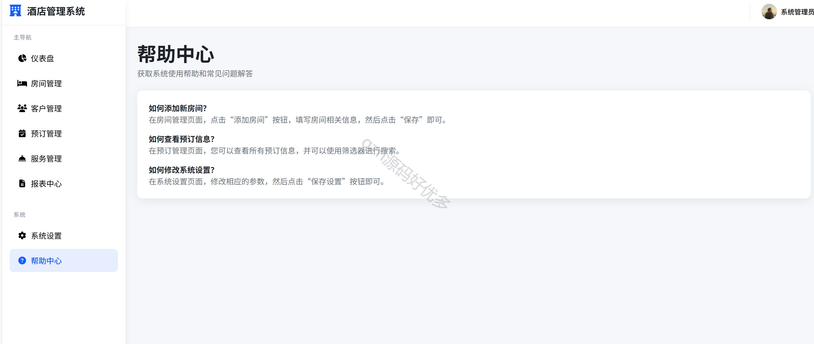

# python040
python040基于Python+Flask的酒店管理系统
 
## 查看主页获取源码

### 一、关键词

酒店系统，酒店管理系统

 

### 二、作品包含

源码+数据库+设计文档+全套环境和工具资源+部署教程

 

### 三、项目技术

前端技术：css+html + Jquery
后端技术：Python3.11,Flask
  

 

### 四、运行环境（以下版本亲测，其他版本未知，请自测）

开发工具：PyCharm 

数据库：MySQL8

数据库管理工具：Navicat10+

Python3.11

浏览器：谷歌浏览器

 

### 五、项目介绍

项目编号：python040

随着酒店行业数字化转型需求的提升，传统人工管理模式在效率、准确性和客户体验方面的局限性日益凸显。本项目旨在开发一套基于 Web 的酒店管理系统，实现客房信息管理、预订流程自动化、入住 / 退房管理、财务统计等核心功能，提升酒店运营效率，降低管理成本。

【功能模块】
- 客房管理模块
- 预订管理模块
- 客户管理模块
- 服务管理模块
- 功能齐全，操作简单方便
- 让酒店管理更高效智能

 

### 六、运行截图

